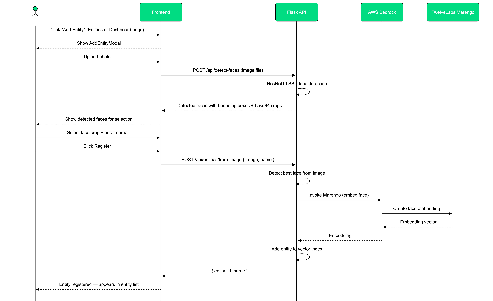
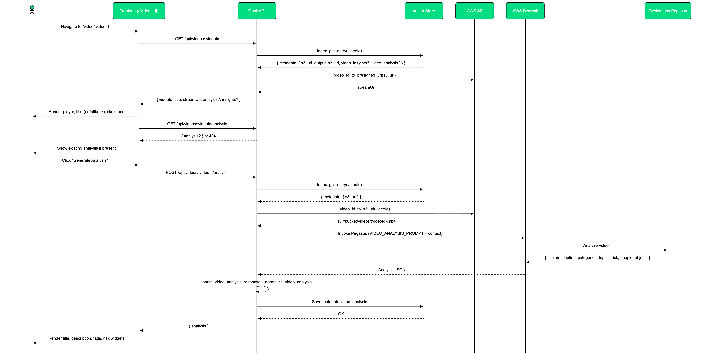
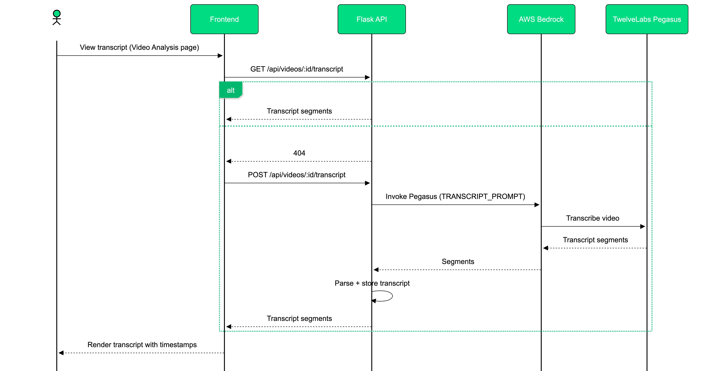
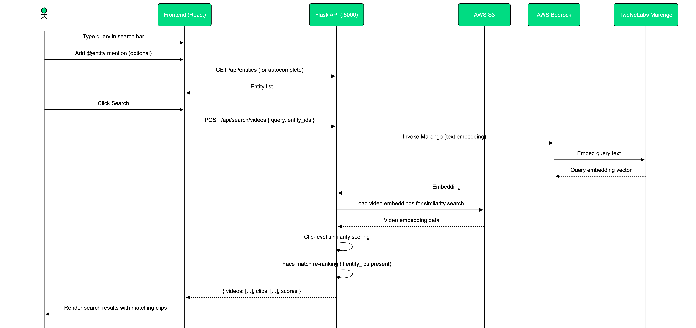
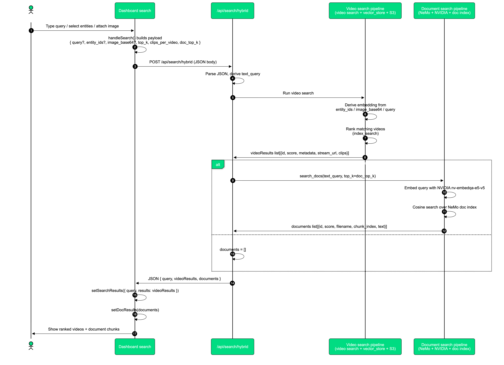
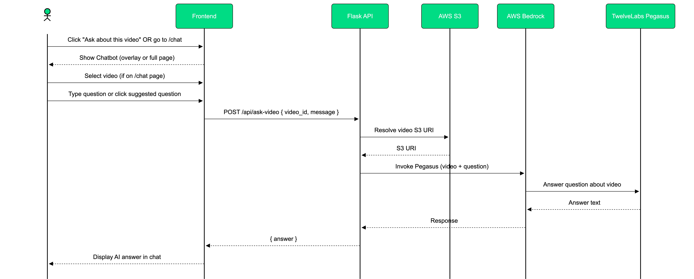

## Multi-Source Legal Evidence Investigator API Reference


- **Base URL** - `http://localhost:5000` (default Flask dev server)
- **Prefix** - Most endpoints are under `/api`. Paths below are relative to the base URL.
- **Content types** -
  - JSON requests - `Content-Type: application/json`
  - File uploads - `multipart/form-data`

---

## Health & Service Info

- **GET `/`**
  - **Description** - Quick probe to confirm the API service name and basic status.
  - **Response 200** -
    ```json
    {
      "service": "video-compliance-api",
      "status": "ok"
    }
    ```

- **GET `/health`**
  - **Description** - Simple health check for monitoring.
  - **Response 200** -
    ```json
    {
      "status": "healthy"
    }
    ```

---

## Face Utilities (`/api`)

### Detect faces in an image

- **POST `/api/detect-faces`**
  - **Description** - Detects all faces in an uploaded image and returns cropped face images and metadata.
  - **Request (multipart/form-data)** -
    - `image` (file, required) - Input image.
    - Query params -
      - `size` (int, optional, default `256`, min `64`, max `1024`) - Output crop size in pixels.
  - **Response 200** -
    ```json
    {
      "count": 2,
      "faces": [
        {
          "confidence": 0.98,
          "bbox": { "x": 100, "y": 50, "w": 80, "h": 80 },
          "image_base64": "..."  // PNG face crop, base64-encoded
        }
      ]
    }
    ```
  - **Error responses** -
    - `400` if the `image` field is missing or filename is empty.

### Detect first face (as PNG)

- **POST `/api/detect-faces/first`**
  - **Description** - Returns the first detected face as a PNG image.
  - **Request (multipart/form-data)** -
    - `image` (file, required).
    - Query params -
      - `size` (int, optional, default `256`, min `64`, max `1024`).
  - **Response 200** - Raw `image/png` body of the first face crop.
  - **Error responses** -
    - `400` if `image` is missing.
    - `404` if no faces are detected.

---

## Entity Management (`/api`)



### List entities

- **GET `/api/entities`**
  - **Description** - Lists all indexed entities (e.g., known people) stored in the vector index.
  - **Response 200** -
    ```json
    {
      "indexId": "default",
      "count": 3,
      "entities": [
        {
          "id": "officer-jane-doe",
          "type": "entity",
          "metadata": {
            "name": "Officer Jane Doe",
            "face_snap_base64": "..."
          }
        }
      ]
    }
    ```

### Create entity from image

- **POST `/api/entities/from-image`**
  - **Description** - Detects a face in the uploaded image, embeds it, and creates an entity in the index.
  - **Request (multipart/form-data)** -
    - `image` (file, required) - Clear front-facing photo.
    - `name` (string, required) - Human-readable name (used to derive the entity ID).
  - **Behavior** -
    - Uses the best detected face, embeds it, and stores it along with a face snapshot.
    - Entity ID is derived from `name` (lowercase, spaces replaced with `-`).
  - **Response 200** -
    ```json
    {
      "indexId": "default",
      "entity": {
        "id": "officer-jane-doe",
        "name": "Officer Jane Doe"
      },
      "face_snap_base64": "..."
    }
    ```
  - **Error responses**:
    - `400` for missing file, empty filename, or missing `name`.
    - `404` if no face is detected.

---

## Embedding Utilities (`/api/embed`)

These endpoints expose low-level embedding operations (text/image/multimodal).

### Text embedding

- **POST `/api/embed/text`**
  - **Request (JSON or form)**:
    - `text` (string, required): Text to embed.
  - **Response 200**:
    ```json
    {
      "embedding": [0.01, 0.23, ...],
      "indexId": "default"
    }
    ```
  - **Error responses**:
    - `400` if `text` is missing or empty.
    - `500` if embedding fails.

### Image embedding

- **POST `/api/embed/image`**
  - **Request**:
    - Option A (multipart/form-data):
      - `image` (file, optional).
    - Option B (JSON):
      - `base64` or `image_base64` (string, optional): Raw image data.
      - `s3Location` or `s3_uri` (object/string, optional):
        - If object: `{ "uri": "s3://bucket/key", "bucketOwner": "..." }`
        - If string: S3 URI.
  - **Behavior**: One of the above sources must be provided.
  - **Response 200**: Same structure as text embedding.
  - **Error responses**:
    - `400` if no valid image source is provided.
    - `500` on embedding errors.

### Text+Image embedding

- **POST `/api/embed/text-image`**
  - **Request**:
    - `text` (string, required).
    - Image source via:
      - `image` (file, multipart), or
      - `base64` / `image_base64`, or
      - `s3Location` / `s3_uri`.
  - **Response 200**: Combined multimodal embedding.
  - **Error responses**:
    - `400` if either `text` or image is missing.
    - `500` on embedding errors.

---

## Vector Index Utilities (`/api/index`)

### Add an indexed item

- **POST `/api/index/add`**
  - **Description**: Adds an arbitrary item (entity, etc.) to the vector index.
  - **Request (JSON)**:
    - `embedding` (array of float, optional): Pre-computed embedding.
    - `text` (string, optional): If provided and `embedding` is omitted, the service will embed `text`.
    - `id` (string, optional): ID to use; may be generated/overridden by the index.
    - `metadata` (object, optional): Arbitrary metadata to store.
    - `type` (string, optional, default `"entity"`): Index record type.
  - **Response 200**:
    ```json
    {
      "indexId": "default",
      "id": "generated-or-provided-id",
      "metadata": { },
      "type": "entity"
    }
    ```
  - **Error responses**:
    - `400` if neither `embedding` nor `text` is provided.
    - `500` on embedding failures.

---

## Document Ingestion & Search (`/api/documents`)

### Upload and ingest a document

- **POST `/api/documents/upload`**
  - **Description**: Uploads a document, stores it (e.g. S3), extracts chunks, and embeds them via NeMo Retriever.
  - **Request (multipart/form-data)**:
    - `document` (file, required).
  - **Behavior**:
    - Validates extension against a configured allow-list.
    - Enforces a maximum file size.
    - Uploads binary to object storage.
    - Runs ingestion to produce text chunks and embeddings.
  - **Response 200**:
    ```json
    {
      "doc_id": "abcd1234",
      "filename": "policy.pdf",
      "chunks": 42,
      "status": "ready"
    }
    ```
  - **Error responses**:
    - `400` for missing file, empty filename, unsupported extension, or size too large.
    - `500` if upload or ingestion fails.

### List ingested documents

- **GET `/api/documents`**
  - **Description**: Lists documents known to the NeMo Retriever store (with chunk counts).
  - **Response 200**:
    ```json
    {
      "documents": [
        {
          "doc_id": "abcd1234",
          "filename": "policy.pdf",
          "chunks": 42,
          "status": "ready"
        }
      ]
    }
    ```

### Semantic search over documents

- **POST `/api/documents/search`**
  - **Request (JSON)**:
    - `query` (string, required): Natural-language query.
    - `top_k` (int, optional, default `10`, min `1`, max `50`).
  - **Response 200**:
    ```json
    {
      "query": "what is the escalation policy?",
      "count": 5,
      "results": [
        {
          "score": 0.87,
          "text": "...",
          "doc_id": "abcd1234",
          "chunk_id": "..."
        }
      ]
    }
    ```
  - **Error responses**:
    - `400` if `query` is missing/empty.
    - `500` on retrieval errors.

---

## Video Upload & Management (`/api/videos`)


### Upload a video for analysis

- **POST `/api/videos/upload`**
  - **Description**: Uploads a video, stores it, extracts a thumbnail + duration, and enqueues embedding/analysis.
  - **Request (multipart/form-data)**:
    - `video` (file, required).
    - `tags` (string, optional): Comma-separated list, e.g. `"traffic-stop,training"`.
  - **Limits**:
    - Max size: `300 MB`; larger files return `400`.
  - **Response 200**:
    ```json
    {
      "task_id": "video-id",
      "filename": "bodycam.mp4",
      "status": "queued",
      "s3_uri": "s3://...",
      "indexId": "default"
    }
    ```

### List video processing tasks

- **GET `/api/videos/tasks`**
  - **Description**: Lists all known video processing tasks (recent first).
  - **Response 200**:
    ```json
    {
      "tasks": [
        {
          "task_id": "video-id",
          "filename": "bodycam.mp4",
          "status": "queued|indexing|ready|failed",
          "s3_uri": "s3://...",
          "output_s3_uri": "s3://...",
          "uploaded_at": "..."
        }
      ],
      "count": 1
    }
    ```

### Get a specific task

- **GET `/api/videos/tasks/{task_id}`**
  - **Description**: Returns current status and metadata for a single task.
  - **Behavior**:
    - If status is `indexing` and an async Bedrock invocation ARN is set, it will poll Bedrock and update the index when completed.
  - **Response 200**: Task object (same structure as in `/api/videos/tasks`).
  - **Error responses**:
    - `404` if task is unknown.

### Reindex an existing video

- **POST `/api/videos/{video_id}/reindex`**
  - **Description**: Re-triggers the embedding/clip extraction pipeline for an already uploaded video.
  - **Response 200**:
    ```json
    {
      "task_id": "video-id",
      "filename": "bodycam.mp4",
      "status": "queued",
      "s3_uri": "s3://...",
      "indexId": "default"
    }
    ```
  - **Error responses**:
    - `400` if `video_id` is missing or the record lacks S3 info.
    - `404` if video is not found in the index.

### List videos with playback URLs

- **GET `/api/videos`**
  - **Description**: Lists all indexed videos with resolved stream and thumbnail URLs.
  - **Response 200**:
    ```json
    {
      "indexId": "default",
      "count": 1,
      "videos": [
        {
          "id": "video-id",
          "metadata": {
            "filename": "bodycam.mp4",
            "status": "ready",
            "duration_seconds": 600,
            "thumbnail_base64": "..."
          },
          "stream_url": "https://...",
          "thumbnail_url": "https://...",
          "thumbnail_data_url": "data:image/jpeg;base64,...",
          "duration_seconds": 600
        }
      ]
    }
    ```

---

## Video Analysis & Transcript (`/api/videos/{video_id}`)



### Generate detailed video analysis

- **POST `/api/videos/{video_id}/analysis`**
  - **Description**: Runs a large-language-model-based analysis over the video and stores a structured summary in the index.
  - **Response 200**:
    ```json
    {
      "video_id": "video-id",
      "analysis": {
        "title": "...",
        "categories": [],
        "topics": [],
        "risks": [],
        "transcript": [],
        "riskLevel": "low|medium|high"
      }
    }
    ```
  - **Error responses**:
    - `400` if `video_id` is missing or S3 location is absent.
    - `404` if video is not found.
    - `422` if the analysis response cannot be parsed.
    - `500` for general failures.



### Transcript - read or generate

- **GET `/api/videos/{video_id}/transcript`**
  - **Description**: Returns the stored transcript if available.
  - **Response 200**:
    ```json
    {
      "video_id": "video-id",
      "transcript": [ { "time": "0:05", "speaker": "officer", "text": "..." } ],
      "count": 123
    }
    ```
  - or
    ```json
    {
      "video_id": "video-id",
      "transcript": null,
      "message": "No transcript yet. Use POST to generate."
    }
    ```

- **POST `/api/videos/{video_id}/transcript`**
  - **Description**: Generates a detailed transcript via Pegasus and stores it on the video.
  - **Request (JSON, optional)**:
    - `append_from_seconds` (number, optional): If provided and a transcript exists, only append from this timestamp.
  - **Response 200**: Same schema as GET.
  - **Error responses**:
    - `400` for missing `video_id`.
    - `404` if video not found.
    - `422` if transcript cannot be parsed.
    - `500` on errors.

---

## Video Frames & Cached Images (`/api/videos/{video_id}`)

### Extract a frame

- **GET `/api/videos/{video_id}/frame`**
  - **Query params**:
    - `t` (float, required): Timestamp in seconds.
  - **Response 200**: JPEG image of the frame.
  - **Error responses**:
    - `400` for missing/negative `t`.
    - `404` if video/stream URL is unknown.
    - `503` if ffmpeg is unavailable or frame extraction fails.
    - `504` on ffmpeg timeout.

### Cached face images

- **GET `/api/videos/{video_id}/faces/{face_id}`**
  - **Description**: Returns a PNG of a previously detected face from disk cache.
  - **Response 200**: `image/png` body.
  - **Error responses**:
    - `400` for invalid IDs.
    - `404` if face image not found.

### Cached object frame images

- **GET `/api/videos/{video_id}/object-frames/{filename}`**
  - **Description**: Returns a JPEG of a cached object frame.
  - **Response 200**: `image/jpeg` body.
  - **Error responses**:
    - `400` for invalid `filename` (security-checked).
    - `404` if object frame not found.

---

## Video Insights & Face Presence (`/api/videos/{video_id}`)


### Generate or fetch video insights

- **GET `/api/videos/{video_id}/insights`**
  - **Description**: Returns cached insights (objects, faces, keyframes, duration) for the video.
  - **Response 200**:
    ```json
    {
      "video_id": "video-id",
      "insights": {
        "objects": [
          {
            "object": "car",
            "timestamp": 12.3,
            "frame_url": "/api/videos/video-id/object-frames/..."
          }
        ],
        "detected_faces": [
          {
            "face_id": 0,
            "confidence": 0.95,
            "image_base64": "...",
            "face_path": "face_0.png",
            "bbox": { },
            "timestamps": [12.3, 45.6],
            "appearance_count": 2
          }
        ],
        "keyframes": [],
        "video_duration_sec": 600.0
      }
    }
    ```

- **POST `/api/videos/{video_id}/insights`**
  - **Description**: Triggers fresh insight generation (objects + faces) using Pegasus and local detectors.
  - **Preconditions**:
    - Video must exist and have `status: "ready"`.
  - **Response 200**: Same schema as GET, but with newly generated data.
  - **Error responses**:
    - `400` for missing `video_id`, missing S3 location, or non-ready status.
    - `404` if video not found.
    - `500` for processing errors.

### Face presence timeline

- **GET `/api/videos/{video_id}/face-presence`**
  - **Description**: Returns per-face presence across the video duration, partitioned into segments.
  - **Response 200** (when faces present):
    ```json
    {
      "video_id": "video-id",
      "duration_sec": 600.0,
      "segments": 30,
      "presence": [
        {
          "face_id": 0,
          "segment_presence": [1, 1, 0]
        }
      ]
    }
    ```
  - or, when no faces:
    ```json
    {
      "video_id": "video-id",
      "duration_sec": 600.0,
      "segments": 0,
      "presence": [],
      "message": "No detected faces. Generate insights first."
    }
    ```
  - **Error responses**:
    - `400` for missing `video_id`.
    - `404` if video not found.

---

## Search APIs (`/api/search`)



### Video search (text or entity-aware)

- **POST `/api/search/videos`**
  - **Description**: Runs the main video search pipeline and returns ranked video results with optional clips.
  - **Request (JSON)**:
    - `query` / `text` (string, optional but recommended): Text query; exact semantics depend on `get_search_embedding_from_request`.
    - `top_k` (int, optional): Max videos to return (default `24`, max `100`).
    - `clips_per_video` (int, optional): Max clips per video (default `5` for text search, `1` for entity search; max `20`).
    - `filter` / `metadata_filter` (object, optional): Exact-match filters on video metadata.
  - **Response 200**:
    ```json
    {
      "indexId": "default",
      "query": "search text",
      "count": 3,
      "results": [
        {
          "id": "video-id",
          "score": 0.91,
          "metadata": { },
          "stream_url": "https://...",
          "clips": [
            {
              "start": 10.0,
              "end": 15.0,
              "score": 0.88
            }
          ]
        }
      ]
    }
    ```
  - **Error responses**:
    - `400` if embeddings cannot be created.
    - `500` for unexpected errors.

### Hybrid video + document search



- **POST `/api/search/hybrid`**
  - **Description**: Returns both video results and NeMo document chunks in a single call.
  - **Request (JSON)**:
    - Same fields as `/api/search/videos`, plus:
      - `doc_top_k` (int, optional, default `10`, max `20`): Document results.
  - **Response 200**:
    ```json
    {
      "query": "search text",
      "videoCount": 3,
      "videoResults": [],
      "docCount": 5,
      "documents": [],
      "doc_error": ""
    }
    ```
  - **Error responses**:
    - `400` when an embedding error occurs and there are no video/doc results.

### Entity index search

- **POST `/api/search/entity`**
  - **Description**: Generic vector search over the index (default `type="entity"`).
  - **Request (JSON or form)**:
    - `query` / `text` (string, required).
    - `top_k` (int, optional, default `20`, max `100`).
    - `type` (string, optional, default `"entity"`).
    - `filter` / `metadata_filter` (object, optional).
  - **Response 200**:
    ```json
    {
      "indexId": "default",
      "results": [
        {
          "id": "officer-jane-doe",
          "score": 0.93,
          "metadata": { }
        }
      ]
    }
    ```
  - **Error responses**:
    - `400` if query is missing/empty.
    - `500` on embedding/search errors.

### Image-based index search

- **POST `/api/search/image`**
  - **Description**: Embeds an image and searches the vector index for similar items.
  - **Request**:
    - Same image-source options as `/api/embed/image`.
    - Optional:
      - `top_k` (int, default `20`, max `100`).
      - `type` (string, optional).
      - `filter` / `metadata_filter` (object, optional).
  - **Response 200**:
    ```json
    {
      "indexId": "default",
      "results": []
    }
    ```
  - **Error responses**:
    - `400` if no image is provided.
    - `500` for embedding/search failures.

---

## Question-Answering on Video (`/api`)



### Ask a question about a specific video

- **POST `/api/ask-video`**
  - **Description**: Runs a QA-style prompt against a video using Pegasus, based on its S3 location.
  - **Request (JSON)**:
    - `video_id` (string, required): Must correspond to an indexed video.
    - `message` (string, required): User’s question.
  - **Response 200**:
    ```json
    {
      "answer": "detailed natural-language answer",
      "video_id": "video-id"
    }
    ```
  - **Error responses**:
    - `400` for missing `video_id` or `message`.
    - `404` if the video has no known S3 location.
    - `500` on Pegasus errors.

## Multi-Source Legal Evidence Investigator API Reference

- **Base URL** - `http://localhost:5000` (default Flask dev server)
- **Prefix** - Most endpoints are under `/api`. Paths below are relative to the base URL.
- **Content types** -
  - JSON requests - `Content-Type: application/json`
  - File uploads - `multipart/form-data`

---

## Health & Service Info

- **GET `/`**
  - **Description** - Quick probe to confirm the API service name and basic status.
  - **Response 200** -
    ```json
    {
      "service": "video-compliance-api",
      "status": "ok"
    }
    ```

- **GET `/health`**
  - **Description** - Simple health check for monitoring.
  - **Response 200** -
    ```json
    {
      "status": "healthy"
    }
    ```

---

## Face Utilities (`/api`)

### Detect faces in an image

- **POST `/api/detect-faces`**
  - **Description** - Detects all faces in an uploaded image and returns cropped face images and metadata.
  - **Request (multipart/form-data)** -
    - `image` (file, required) - Input image.
    - Query params -
      - `size` (int, optional, default `256`, min `64`, max `1024`) - Output crop size in pixels.
  - **Response 200** -
    ```json
    {
      "count": 2,
      "faces": [
        {
          "confidence": 0.98,
          "bbox": { "x": 100, "y": 50, "w": 80, "h": 80 },
          "image_base64": "..."  // PNG face crop, base64-encoded
        }
      ]
    }
    ```
  - **Error responses** -
    - `400` if the `image` field is missing or filename is empty.

### Detect first face (as PNG)

- **POST `/api/detect-faces/first`**
  - **Description** - Returns the first detected face as a PNG image.
  - **Request (multipart/form-data)** -
    - `image` (file, required).
    - Query params -
      - `size` (int, optional, default `256`, min `64`, max `1024`).
  - **Response 200** - Raw `image/png` body of the first face crop.
  - **Error responses** -
    - `400` if `image` is missing.
    - `404` if no faces are detected.

---

## Entity Management (`/api`)


### List entities

- **GET `/api/entities`**
  - **Description** - Lists all indexed entities (e.g., known people) stored in the vector index.
  - **Response 200** -
    ```json
    {
      "indexId": "default",
      "count": 3,
      "entities": [
        {
          "id": "officer-jane-doe",
          "type": "entity",
          "metadata": {
            "name": "Officer Jane Doe",
            "face_snap_base64": "..."
          }
        }
      ]
    }
    ```

### Create entity from image

- **POST `/api/entities/from-image`**
  - **Description** - Detects a face in the uploaded image, embeds it, and creates an entity in the index.
  - **Request (multipart/form-data)** -
    - `image` (file, required) - Clear front-facing photo.
    - `name` (string, required) - Human-readable name (used to derive the entity ID).
  - **Behavior** -
    - Uses the best detected face, embeds it, and stores it along with a face snapshot.
    - Entity ID is derived from `name` (lowercase, spaces replaced with `-`).
  - **Response 200** -
    ```json
    {
      "indexId": "default",
      "entity": {
        "id": "officer-jane-doe",
        "name": "Officer Jane Doe"
      },
      "face_snap_base64": "..."
    }
    ```
  - **Error responses**:
    - `400` for missing file, empty filename, or missing `name`.
    - `404` if no face is detected.

---

## Embedding Utilities (`/api/embed`)

These endpoints expose low-level embedding operations (text/image/multimodal).

### Text embedding

- **POST `/api/embed/text`**
  - **Request (JSON or form)**:
    - `text` (string, required): Text to embed.
  - **Response 200**:
    ```json
    {
      "embedding": [0.01, 0.23, ...],
      "indexId": "default"
    }
    ```
  - **Error responses**:
    - `400` if `text` is missing or empty.
    - `500` if embedding fails.

### Image embedding

- **POST `/api/embed/image`**
  - **Request**:
    - Option A (multipart/form-data):
      - `image` (file, optional).
    - Option B (JSON):
      - `base64` or `image_base64` (string, optional): Raw image data.
      - `s3Location` or `s3_uri` (object/string, optional):
        - If object: `{ "uri": "s3://bucket/key", "bucketOwner": "..." }`
        - If string: S3 URI.
  - **Behavior**: One of the above sources must be provided.
  - **Response 200**: Same structure as text embedding.
  - **Error responses**:
    - `400` if no valid image source is provided.
    - `500` on embedding errors.

### Text+Image embedding

- **POST `/api/embed/text-image`**
  - **Request**:
    - `text` (string, required).
    - Image source via:
      - `image` (file, multipart), or
      - `base64` / `image_base64`, or
      - `s3Location` / `s3_uri`.
  - **Response 200**: Combined multimodal embedding.
  - **Error responses**:
    - `400` if either `text` or image is missing.
    - `500` on embedding errors.

---

## Vector Index Utilities (`/api/index`)

### Add an indexed item

- **POST `/api/index/add`**
  - **Description**: Adds an arbitrary item (entity, etc.) to the vector index.
  - **Request (JSON)**:
    - `embedding` (array of float, optional): Pre-computed embedding.
    - `text` (string, optional): If provided and `embedding` is omitted, the service will embed `text`.
    - `id` (string, optional): ID to use; may be generated/overridden by the index.
    - `metadata` (object, optional): Arbitrary metadata to store.
    - `type` (string, optional, default `"entity"`): Index record type.
  - **Response 200**:
    ```json
    {
      "indexId": "default",
      "id": "generated-or-provided-id",
      "metadata": { ... },
      "type": "entity"
    }
    ```
  - **Error responses**:
    - `400` if neither `embedding` nor `text` is provided.
    - `500` on embedding failures.

---

## Document Ingestion & Search (`/api/documents`)

### Upload and ingest a document

- **POST `/api/documents/upload`**
  - **Description**: Uploads a document, stores it (e.g. S3), extracts chunks, and embeds them via NeMo Retriever.
  - **Request (multipart/form-data)**:
    - `document` (file, required).
  - **Behavior**:
    - Validates extension against a configured allow-list.
    - Enforces a maximum file size.
    - Uploads binary to object storage.
    - Runs ingestion to produce text chunks and embeddings.
  - **Response 200**:
    ```json
    {
      "doc_id": "abcd1234",
      "filename": "policy.pdf",
      "chunks": 42,
      "status": "ready"
    }
    ```
  - **Error responses**:
    - `400` for missing file, empty filename, unsupported extension, or size too large.
    - `500` if upload or ingestion fails.

### List ingested documents

- **GET `/api/documents`**
  - **Description**: Lists documents known to the NeMo Retriever store (with chunk counts).
  - **Response 200**:
    ```json
    {
      "documents": [
        {
          "doc_id": "abcd1234",
          "filename": "policy.pdf",
          "chunks": 42,
          "status": "ready"
        }
      ]
    }
    ```

### Semantic search over documents

- **POST `/api/documents/search`**
  - **Request (JSON)**:
    - `query` (string, required): Natural-language query.
    - `top_k` (int, optional, default `10`, min `1`, max `50`).
  - **Response 200**:
    ```json
    {
      "query": "what is the escalation policy?",
      "count": 5,
      "results": [
        {
          "score": 0.87,
          "text": "...",
          "doc_id": "abcd1234",
          "chunk_id": "..."
        }
      ]
    }
    ```
  - **Error responses**:
    - `400` if `query` is missing/empty.
    - `500` on retrieval errors.

---

## Video Upload & Management (`/api/videos`)


### Upload a video for analysis

- **POST `/api/videos/upload`**
  - **Description**: Uploads a video, stores it, extracts a thumbnail + duration, and enqueues embedding/analysis.
  - **Request (multipart/form-data)**:
    - `video` (file, required).
    - `tags` (string, optional): Comma-separated list, e.g. `"traffic-stop,training"`.
  - **Limits**:
    - Max size: `300 MB`; larger files return `400`.
  - **Response 200**:
    ```json
    {
      "task_id": "video-id",
      "filename": "bodycam.mp4",
      "status": "queued",
      "s3_uri": "s3://...",
      "indexId": "default"
    }
    ```

### List video processing tasks

- **GET `/api/videos/tasks`**
  - **Description**: Lists all known video processing tasks (recent first).
  - **Response 200**:
    ```json
    {
      "tasks": [
        {
          "task_id": "video-id",
          "filename": "bodycam.mp4",
          "status": "queued|indexing|ready|failed",
          "s3_uri": "s3://...",
          "output_s3_uri": "s3://...",
          "uploaded_at": "..."
        }
      ],
      "count": 1
    }
    ```

### Get a specific task

- **GET `/api/videos/tasks/{task_id}`**
  - **Description**: Returns current status and metadata for a single task.
  - **Behavior**:
    - If status is `indexing` and an async Bedrock invocation ARN is set, it will poll Bedrock and update the index when completed.
  - **Response 200**: Task object (same structure as in `/api/videos/tasks`).
  - **Error responses**:
    - `404` if task is unknown.

### Reindex an existing video

- **POST `/api/videos/{video_id}/reindex`**
  - **Description**: Re-triggers the embedding/clip extraction pipeline for an already uploaded video.
  - **Response 200**:
    ```json
    {
      "task_id": "video-id",
      "filename": "bodycam.mp4",
      "status": "queued",
      "s3_uri": "s3://...",
      "indexId": "default"
    }
    ```
  - **Error responses**:
    - `400` if `video_id` is missing or the record lacks S3 info.
    - `404` if video is not found in the index.

### List videos with playback URLs

- **GET `/api/videos`**
  - **Description**: Lists all indexed videos with resolved stream and thumbnail URLs.
  - **Response 200**:
    ```json
    {
      "indexId": "default",
      "count": 1,
      "videos": [
        {
          "id": "video-id",
          "metadata": {
            "filename": "bodycam.mp4",
            "status": "ready",
            "duration_seconds": 600,
            "thumbnail_base64": "..."
          },
          "stream_url": "https://...",
          "thumbnail_url": "https://...",
          "thumbnail_data_url": "data:image/jpeg;base64,...",
          "duration_seconds": 600
        }
      ]
    }
    ```

---

## Video Analysis & Transcript (`/api/videos/{video_id}`)


### Generate detailed video analysis

- **POST `/api/videos/{video_id}/analysis`**
  - **Description**: Runs a large-language-model-based analysis over the video and stores a structured summary in the index.
  - **Response 200**:
    ```json
    {
      "video_id": "video-id",
      "analysis": {
        "title": "...",
        "categories": [...],
        "topics": [...],
        "risks": [...],
        "transcript": [...],
        "riskLevel": "low|medium|high"
      }
    }
    ```
  - **Error responses**:
    - `400` if `video_id` is missing or S3 location is absent.
    - `404` if video is not found.
    - `422` if the analysis response cannot be parsed.
    - `500` for general failures.


### Transcript - read or generate

- **GET `/api/videos/{video_id}/transcript`**
  - **Description**: Returns the stored transcript if available.
  - **Response 200**:
    ```json
    {
      "video_id": "video-id",
      "transcript": [ { "time": "0:05", "speaker": "officer", "text": "..." } ],
      "count": 123
    }
    ```
    or
    ```json
    {
      "video_id": "video-id",
      "transcript": null,
      "message": "No transcript yet. Use POST to generate."
    }
    ```

- **POST `/api/videos/{video_id}/transcript`**
  - **Description**: Generates a detailed transcript via Pegasus and stores it on the video.
  - **Request (JSON, optional)**:
    - `append_from_seconds` (number, optional): If provided and a transcript exists, only append from this timestamp.
  - **Response 200**: Same schema as GET.
  - **Error responses**:
    - `400` for missing `video_id`.
    - `404` if video not found.
    - `422` if transcript cannot be parsed.
    - `500` on errors.

---

## Video Frames & Cached Images (`/api/videos/{video_id}`)

### Extract a frame

- **GET `/api/videos/{video_id}/frame`**
  - **Query params**:
    - `t` (float, required): Timestamp in seconds.
  - **Response 200**: JPEG image of the frame.
  - **Error responses**:
    - `400` for missing/negative `t`.
    - `404` if video/stream URL is unknown.
    - `503` if ffmpeg is unavailable or frame extraction fails.
    - `504` on ffmpeg timeout.

### Cached face images

- **GET `/api/videos/{video_id}/faces/{face_id}`**
  - **Description**: Returns a PNG of a previously detected face from disk cache.
  - **Response 200**: `image/png` body.
  - **Error responses**:
    - `400` for invalid IDs.
    - `404` if face image not found.

### Cached object frame images

- **GET `/api/videos/{video_id}/object-frames/{filename}`**
  - **Description**: Returns a JPEG of a cached object frame.
  - **Response 200**: `image/jpeg` body.
  - **Error responses**:
    - `400` for invalid `filename` (security-checked).
    - `404` if object frame not found.

---

## Video Insights & Face Presence (`/api/videos/{video_id}`)


### Generate or fetch video insights

- **GET `/api/videos/{video_id}/insights`**
  - **Description**: Returns cached insights (objects, faces, keyframes, duration) for the video.
  - **Response 200**:
    ```json
    {
      "video_id": "video-id",
      "insights": {
        "objects": [
          {
            "object": "car",
            "timestamp": 12.3,
            "frame_url": "/api/videos/video-id/object-frames/..."
          }
        ],
        "detected_faces": [
          {
            "face_id": 0,
            "confidence": 0.95,
            "image_base64": "...",
            "face_path": "face_0.png",
            "bbox": { ... },
            "timestamps": [12.3, 45.6],
            "appearance_count": 2
          }
        ],
        "keyframes": [ ... ],
        "video_duration_sec": 600.0
      }
    }
    ```

- **POST `/api/videos/{video_id}/insights`**
  - **Description**: Triggers fresh insight generation (objects + faces) using Pegasus and local detectors.
  - **Preconditions**:
    - Video must exist and have `status: "ready"`.
  - **Response 200**: Same schema as GET, but with newly generated data.
  - **Error responses**:
    - `400` for missing `video_id`, missing S3 location, or non-ready status.
    - `404` if video not found.
    - `500` for processing errors.

### Face presence timeline

- **GET `/api/videos/{video_id}/face-presence`**
  - **Description**: Returns per-face presence across the video duration, partitioned into segments.
  - **Response 200** (when faces present):
    ```json
    {
      "video_id": "video-id",
      "duration_sec": 600.0,
      "segments": 30,
      "presence": [
        {
          "face_id": 0,
          "segment_presence": [1, 1, 0, ...]
        }
      ]
    }
    ```
    or, when no faces:
    ```json
    {
      "video_id": "video-id",
      "duration_sec": 600.0,
      "segments": 0,
      "presence": [],
      "message": "No detected faces. Generate insights first."
    }
    ```
  - **Error responses**:
    - `400` for missing `video_id`.
    - `404` if video not found.

---

## Search APIs (`/api/search`)


### Video search (text or entity-aware)

- **POST `/api/search/videos`**
  - **Description**: Runs the main video search pipeline and returns ranked video results with optional clips.
  - **Request (JSON)**:
    - `query` / `text` (string, optional but recommended): Text query; exact semantics depend on `get_search_embedding_from_request`.
    - `top_k` (int, optional): Max videos to return (default `24`, max `100`).
    - `clips_per_video` (int, optional): Max clips per video (default `5` for text search, `1` for entity search; max `20`).
    - `filter` / `metadata_filter` (object, optional): Exact-match filters on video metadata.
  - **Response 200**:
    ```json
    {
      "indexId": "default",
      "query": "search text",
      "count": 3,
      "results": [
        {
          "id": "video-id",
          "score": 0.91,
          "metadata": { ... },
          "stream_url": "https://...",
          "clips": [
            {
              "start": 10.0,
              "end": 15.0,
              "score": 0.88
            }
          ]
        }
      ]
    }
    ```
  - **Error responses**:
    - `400` if embeddings cannot be created.
    - `500` for unexpected errors.

### Hybrid video + document search


- **POST `/api/search/hybrid`**
  - **Description**: Returns both video results and NeMo document chunks in a single call.
  - **Request (JSON)**:
    - Same fields as `/api/search/videos`, plus:
      - `doc_top_k` (int, optional, default `10`, max `20`): Document results.
  - **Response 200**:
    ```json
    {
      "query": "search text",
      "videoCount": 3,
      "videoResults": [ ... ],
      "docCount": 5,
      "documents": [ ... ],
      "doc_error": "..."  // optional
    }
    ```
  - **Error responses**:
    - `400` when an embedding error occurs and there are no video/doc results.

### Entity index search

- **POST `/api/search/entity`**
  - **Description**: Generic vector search over the index (default `type="entity"`).
  - **Request (JSON or form)**:
    - `query` / `text` (string, required).
    - `top_k` (int, optional, default `20`, max `100`).
    - `type` (string, optional, default `"entity"`).
    - `filter` / `metadata_filter` (object, optional).
  - **Response 200**:
    ```json
    {
      "indexId": "default",
      "results": [
        {
          "id": "officer-jane-doe",
          "score": 0.93,
          "metadata": { ... }
        }
      ]
    }
    ```
  - **Error responses**:
    - `400` if query is missing/empty.
    - `500` on embedding/search errors.

### Image-based index search

- **POST `/api/search/image`**
  - **Description**: Embeds an image and searches the vector index for similar items.
  - **Request**:
    - Same image-source options as `/api/embed/image`.
    - Optional:
      - `top_k` (int, default `20`, max `100`).
      - `type` (string, optional).
      - `filter` / `metadata_filter` (object, optional).
  - **Response 200**:
    ```json
    {
      "indexId": "default",
      "results": [ ... ]
    }
    ```
  - **Error responses**:
    - `400` if no image is provided.
    - `500` for embedding/search failures.

---

## Question-Answering on Video (`/api`)


### Ask a question about a specific video

- **POST `/api/ask-video`**
  - **Description**: Runs a QA-style prompt against a video using Pegasus, based on its S3 location.
  - **Request (JSON)**:
    - `video_id` (string, required): Must correspond to an indexed video.
    - `message` (string, required): User’s question.
  - **Response 200**:
    ```json
    {
      "answer": "detailed natural-language answer",
      "video_id": "video-id"
    }
    ```
  - **Error responses**:
    - `400` for missing `video_id` or `message`.
    - `404` if the video has no known S3 location.
    - `500` on Pegasus errors.

